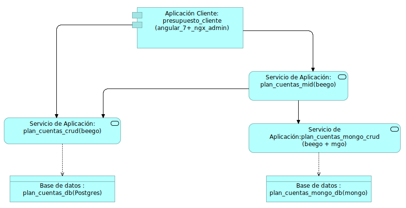

# plan_cuentas_mid
Middleware para modelo de negocio plan_cuentas, proporciona a distintos clientes datos  para la gestión de la información del sistemas financiero, la presente api manipula los datos obtenidos de diferentes bases de datos, relacionales y no relacionales.


## Especificaciones Técnicas

### Tecnologías Implementadas y Versiones
* [Golang](https://github.com/udistrital/introduccion_oas/blob/master/instalacion_de_herramientas/golang.md)
* [BeeGo](https://github.com/udistrital/introduccion_oas/blob/master/instalacion_de_herramientas/beego.md)
* [Docker](https://docs.docker.com/engine/install/ubuntu/)
* [Docker Compose](https://docs.docker.com/compose/)

### Variables de Entorno
```shell
# Ejemplo que se debe actualizar acorde al proyecto
FINANCIERA_MONGO_CRUD_PORT = [descripción]
FINANCIERA_MONGO_CRUD_DB_URL = [descripción]
```

### Ejecución del Proyecto
```shell
#1. Obtener el repositorio con Go
go get github.com/udistrital/plan_cuentas_mid

#2. Moverse a la carpeta del repositorio
cd $GOPATH/src/github.com/udistrital/plan_cuentas_mid

# 3. Moverse a la rama **develop**
git pull origin develop && git checkout develop

# 4. alimentar todas las variables de entorno que utiliza el proyecto.
FINANCIERA_MONGO_CRUD_PORT=8080 FINANCIERA_MONGO_CRUD_DB_URL=127.0.0.1:27017 FINANCIERA_MONGO_CRUD_SOME_VARIABLE=some_value bee run
```
### Ejecución Dockerfile
```shell
# docker build --tag=plan_cuentas_mid . --no-cache
# docker run -p 80:80 plan_cuentas_mid
```
### Ejecución docker-compose
```shell
# Clonar el proyecto de github y ubicarse en la carpeta del proyecto:
git clone https://github.com/udistrital/plan_cuentas_mid.git

# Ingresar al directorio
cd plan_cuentas_mid

#Crear red de contenedores denominada back_end con el comando (si ya esta creada no es necesario crearla):
docker network create back_end

# Construir y correr los contenedores
docker-compose up --build

#Bajar los servicios de los contenedores
docker-compose down

# Subir los servicios de los contenedores ya construidos previamente
docker-compose up
```

## Arquitectura


## Dependencias Utilizadas

**CLIENTES**
- [presupuesto_cliente](https://github.com/udistrital/presupuesto_cliente)
- [necesidades_cliente](https://github.com/udistrital/necesidades_cliente)
- [contabilidad_cliente](https://github.com/udistrital/contabilidad_cliente)

**API CRUD**
- [plan_cuentas_mongo_crud](https://github.com/udistrital/plan_cuentas_mongo_crud)
- [necesidades_crud](https://github.com/udistrital/necesidades_crud)

## Estado CI

| Develop | Relese 0.0.1 | Master |
| -- | -- | -- |
| [](https://hubci.portaloas.udistrital.edu.co/udistrital/plan_cuentas_mid) | [](https://hubci.portaloas.udistrital.edu.co/udistrital/plan_cuentas_mid) | [](https://hubci.portaloas.udistrital.edu.co/udistrital/plan_cuentas_mid) |

## Licencia

[This file is part of plan_cuentas_mid.](LICENSE)

plan_cuentas_mid is free software: you can redistribute it and/or modify it under the terms of the GNU General Public License as published by the Free Software Foundation, either version 3 of the License, or (atSara Sampaio your option) any later version.

plan_cuentas_mid is distributed in the hope that it will be useful, but WITHOUT ANY WARRANTY; without even the implied warranty of MERCHANTABILITY or FITNESS FOR A PARTICULAR PURPOSE. See the GNU General Public License for more details.

You should have received a copy of the GNU General Public License along with plan_cuentas_mid. If not, see https://www.gnu.org/licenses/.
